# Ideal End-to-End CI/CD Flow Design

## Overview
This document outlines the ideal CI/CD pipeline for both mobile and backend applications using Kubernetes as the cloud platform, without budget or infrastructure constraints.

## Architecture Components

### 1. Source Code Management
- **Git Repository**: GitHub/GitLab with branch protection rules
- **Branching Strategy**: GitFlow with feature branches, develop, staging, and main branches
- **Code Review**: Pull Request/Merge Request mandatory with at least 2 reviewers

### 2. CI/CD Platform
- **Primary**: Jenkins with Kubernetes plugin
- **Alternative**: GitHub Actions / GitLab CI
- **Infrastructure as Code**: Terraform for provisioning
- **Configuration Management**: Helm Charts for Kubernetes deployments

### 3. Quality Gates

#### Backend (Spring Boot)
- **Static Code Analysis**: SonarQube with quality gates
- **Security Scanning**: 
  - OWASP Dependency Check
  - Snyk for vulnerability scanning
  - Trivy for container image scanning
- **Unit Tests**: JUnit with minimum 80% code coverage
- **Integration Tests**: TestContainers for database integration
- **Performance Tests**: JMeter or K6 for load testing

#### Mobile (iOS/Android)
- **Static Code Analysis**: SwiftLint (iOS), Android Lint, SonarQube
- **Security Scanning**: MobSF (Mobile Security Framework)
- **Unit Tests**: XCTest (iOS), JUnit/Espresso (Android)
- **UI Tests**: XCUITest (iOS), Espresso (Android)
- **Device Testing**: Firebase Test Lab, AWS Device Farm

### 4. Artifact Management
- **Backend**: Docker Registry (Harbor/AWS ECR/GCR)
- **Mobile**: App Store Connect, Google Play Console
- **Dependencies**: JFrog Artifactory or Nexus Repository

### 5. Environment Strategy

#### Backend Environments
```Development → Testing → Staging → Production
```

#### Mobile Environments
```Development → QA → UAT → Production
```

### 6. Deployment Strategy

#### Backend Kubernetes Deployment
- **Blue-Green Deployment** for zero-downtime deployments
- **Canary Releases** for gradual rollouts
- **Auto-scaling**: HPA (Horizontal Pod Autoscaler) and VPA (Vertical Pod Autoscaler)
- **Service Mesh**: Istio for traffic management and observability

#### Mobile Deployment
- **iOS**: TestFlight for beta testing, App Store for production
- **Android**: Internal testing → Closed testing → Open testing → Production
- **Feature Flags**: LaunchDarkly or similar for controlled feature rollouts

### 7. Monitoring and Observability

#### Backend
- **Metrics**: Prometheus + Grafana
- **Logging**: ELK Stack (Elasticsearch, Logstash, Kibana) or EFK (Fluentd)
- **Tracing**: Jaeger or Zipkin
- **APM**: New Relic, Datadog, or AppDynamics
- **Alerting**: AlertManager with PagerDuty integration

#### Mobile
- **Crash Reporting**: Firebase Crashlytics, Bugsnag
- **Analytics**: Firebase Analytics, Mixpanel
- **Performance Monitoring**: Firebase Performance, New Relic Mobile

### 8. Security Integration

#### DevSecOps Pipeline
- **SAST**: Static Application Security Testing in CI
- **DAST**: Dynamic Application Security Testing in staging
- **Container Security**: Image scanning before deployment
- **Runtime Security**: Falco for Kubernetes runtime security
- **Secrets Management**: HashiCorp Vault or AWS Secrets Manager

### 9. Compliance and Governance
- **Policy as Code**: Open Policy Agent (OPA) for Kubernetes policies
- **Compliance Scanning**: Cloud Security Posture Management (CSPM)
- **Audit Logging**: Comprehensive audit trails for all operations

## CI/CD Pipeline Flow

### Backend Pipeline

```mermaid
graph LR
    A[Code Commit] --> B[Webhook Trigger]
    B --> C[Build & Test]
    C --> D[Security Scan]
    D --> E[Docker Build]
    E --> F[Image Scan]
    F --> G[Deploy to Dev]
    G --> H[Integration Tests]
    H --> I[Deploy to Staging]
    I --> J[Performance Tests]
    J --> K[Deploy to Production]
    K --> L[Monitor & Alert]
```


### Mobile Pipeline


## Implementation Tools

### Kubernetes Infrastructure
- **Cluster Management**: Amazon EKS, Google GKE, or Azure AKS
- **Node Groups**: Mixed instance types with spot instances for cost optimization
- **Networking**: Calico or Cilium for network policies
- **Storage**: CSI drivers for persistent storage
- **Backup**: Velero for cluster backup and disaster recovery

### GitOps Implementation
- **ArgoCD** or **Flux** for GitOps-based deployments
- **Separate Config Repository** for environment-specific configurations
- **Automated Sync** with drift detection and correction

### Advanced Features
- **Multi-Cloud Strategy**: Cluster API for cluster lifecycle management
- **Disaster Recovery**: Cross-region replication and automated failover
- **Cost Optimization**: Cluster autoscaler, node instance optimization
- **Developer Experience**: Skaffold for local development, Telepresence for debugging

## Benefits of This Approach

1. **Reliability**: Automated testing and deployment reduce human errors
2. **Scalability**: Kubernetes provides auto-scaling capabilities
3. **Security**: Integrated security scanning and compliance checks
4. **Observability**: Comprehensive monitoring and alerting
5. **Developer Productivity**: Automated pipelines and fast feedback loops
6. **Cost Efficiency**: Resource optimization and spot instance usage
7. **Compliance**: Built-in audit trails and policy enforcement

## Success Metrics

- **Deployment Frequency**: Multiple deployments per day
- **Lead Time**: Code to production in under 2 hours
- **Change Failure Rate**: Less than 5%
- **Mean Time to Recovery**: Under 30 minutes
- **Test Coverage**: Minimum 80% for backend, 70% for mobile
- **Security Vulnerabilities**: Zero high/critical vulnerabilities in production 